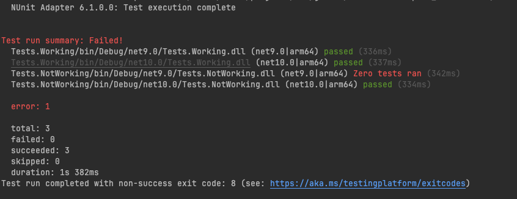

Failing test discovery for NUnit3TestAdapter when using Microsoft.Testing.Platform in dotnet 9.0

# Overview
This repository demonstrates an issue with test discovery when using the NUnit3TestAdapter in conjunction with Microsoft.Testing.Platform in a .NET 9.0 project. The tests are not being discovered as expected, leading to confusion and potential delays in development.

# Steps to Reproduce
1. Clone the repository to your local machine.

2. Restore the NuGet packages:
    ```bash
    dotnet restore
    ```
3. Build the solution:
    ```bash
    dotnet build
    ```
4. Run the tests:
    ```bash
    dotnet test
    ```
5. Observe that no tests are discovered, despite having valid NUnit test cases defined.

